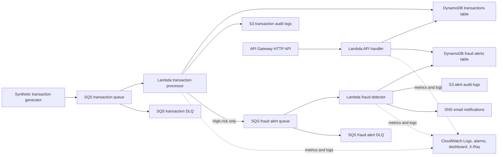

# Financial Transaction Monitoring ETL Pipeline

This project is a serverless AWS pipeline for ingesting financial transactions,
scoring them for fraud risk, and storing both transaction records and fraud
alerts for investigation.

The repository is designed as a portfolio project that demonstrates practical
AWS data engineering skills: event-driven ingestion, Lambda processing,
DynamoDB data modeling, S3 audit storage, Terraform infrastructure, automated
tests, CI validation, and infrastructure security scanning.

## Architecture



More architecture notes are in [docs/architecture.md](docs/architecture.md), and
the main tradeoffs are summarized in [docs/decisions.md](docs/decisions.md).

## What It Demonstrates

- Event-driven ETL design with SQS and Lambda
- Rule-based fraud risk scoring with velocity checks
- DynamoDB data modeling with secondary indexes
- S3 audit logging with encryption and lifecycle policies
- Dead-letter queues for failed transaction and alert processing
- CloudWatch alarms for Lambda errors, DLQ messages, and near-timeout duration
- API Gateway endpoints for transaction and alert lookup workflows
- SNS email notifications for high-risk fraud alerts
- Infrastructure as Code using Terraform
- Local synthetic transaction generation
- Unit tests for Lambda business logic
- GitHub Actions validation for Python, Terraform, and Checkov security scanning

## Repository Structure

```text
.
|-- data-generator/                 # Synthetic transaction event generator
|-- docs/                           # Architecture notes
|-- lambda-functions/               # Lambda handlers
|-- sample-events/                  # Example input and alert payloads
|-- terraform/                      # AWS infrastructure
|-- tests/                          # Unit tests
|-- .github/workflows/ci.yml        # CI checks
|-- pyproject.toml                  # Test configuration
`-- requirements-dev.txt            # Local development dependencies
```

## Pipeline Flow

1. `data-generator/generate_transactions.py` emits realistic transaction JSON.
2. Transactions are sent to the SQS transaction queue.
3. `transaction_processor.py` validates each payload, checks user velocity,
   calculates a risk score, writes the enriched record to DynamoDB, and archives
   an audit copy to S3.
4. High-risk transactions are forwarded to the fraud alert queue.
5. `fraud_detector.py` validates alert messages, stores them in the fraud alerts
   table, archives alert audit records to S3, and publishes optional SNS email
   notifications.
6. `api_handler.py` serves transaction and alert query endpoints through API
   Gateway, including alert status updates.
7. Failed retryable messages move to dead-letter queues after the configured
   receive count.

## Local Development

Create a virtual environment and install dependencies:

```bash
python -m venv .venv
source .venv/bin/activate
pip install -r requirements-dev.txt
```

On Windows PowerShell:

```powershell
python -m venv .venv
.\.venv\Scripts\Activate.ps1
pip install -r requirements-dev.txt
```

Run tests:

```bash
pytest -q
```

Generate sample transactions locally:

```bash
python data-generator/generate_transactions.py --count 5
```

Review example payloads and expected behavior:

```bash
ls sample-events
```

## Terraform Deployment

The default region is `ca-central-1`, which is the closest AWS region to Toronto
and supports the services used by this project. The stack uses pay-per-request or
serverless pricing patterns where possible.

```bash
cd terraform
cp terraform.tfvars.example terraform.tfvars
terraform init
terraform fmt -recursive
terraform validate
terraform plan
terraform apply
```

After deployment, send generated transactions to SQS:

```bash
QUEUE_URL=$(terraform output -raw sqs_transaction_queue_url)
python ../data-generator/generate_transactions.py --count 25 --queue-url "$QUEUE_URL"
```

Query the API:

```bash
API_URL=$(terraform output -raw api_endpoint)
curl "$API_URL/health"
curl "$API_URL/alerts?status=open"
curl -X PATCH "$API_URL/alerts/{alert_id}/status" \
  -H "content-type: application/json" \
  -d '{"status":"investigating"}'
```

To enable high-risk alert emails, add one or more addresses to
`alert_email_addresses` in `terraform.tfvars`. AWS sends a confirmation email
for each SNS subscription before notifications are delivered.

## Demo Evidence

A real AWS demo run is summarized in [docs/demo-run.md](docs/demo-run.md). It
shows generated events, DynamoDB records, S3 audit objects, Lambda log evidence,
sample API responses, and an alert lifecycle example with account-specific
identifiers omitted.

## Security and Cost Notes

- `terraform.tfvars` is intentionally ignored because local variable files can
  contain account-specific or sensitive values.
- DynamoDB uses on-demand billing for unpredictable workloads.
- S3 blocks public access and encrypts objects at rest.
- Lambda logs are retained for a configurable period.
- Dead-letter queues preserve failed events for investigation.
- CloudWatch alarms track Lambda errors, near-timeout duration, and DLQ depth.
- Checkov runs in GitHub Actions as a Terraform security scan.
- No AWS resources are required to run the unit tests.

## Failure Modes

- Invalid transaction payloads are rejected by the transaction processor and are
  not written to DynamoDB or S3.
- Unexpected Lambda failures are retried by SQS and eventually move to a
  dead-letter queue after the configured receive count.
- DLQ CloudWatch alarms surface messages that need manual inspection or replay.
- S3 archive failures are logged but do not block transaction persistence.
- Fraud alert notification failures are logged after the alert is stored.

## Current Scope

Implemented:

- Transaction ingestion queue
- Transaction processor Lambda
- Fraud alert queue
- Fraud detector Lambda
- API Gateway query and alert status endpoints
- DynamoDB transaction and alert storage
- S3 audit logging
- CloudWatch runtime health alarms
- CloudWatch dashboard
- SNS email notifications
- Terraform deployment
- Synthetic transaction generation
- Unit tests, CI, and Checkov security scanning

Future production extensions:

- Remote Terraform state
- API authentication and authorization
- Load testing and performance tuning
