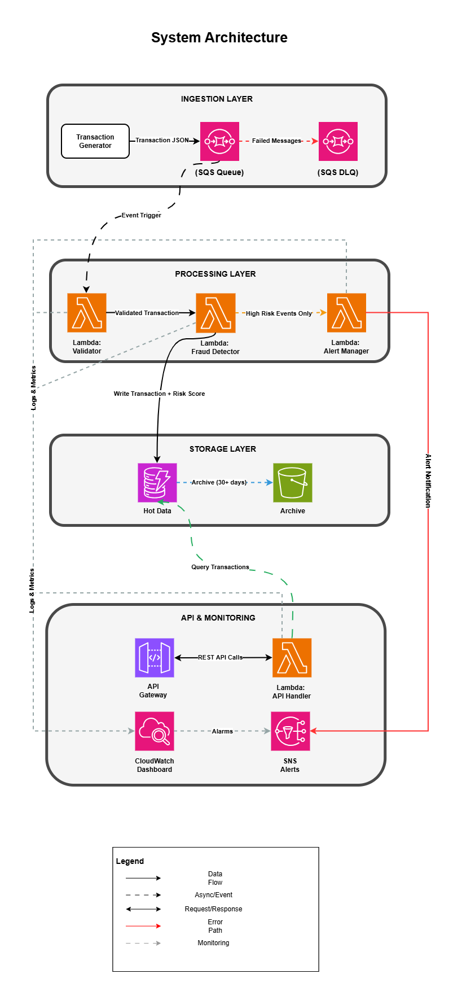

# financial-transaction-monitor
Transaction monitoring systems are tools used to track and analyze financial transactions as they occur and are a critical component of fraud detection and risk management processes.

This project is a real-time financial transaction monitoring pipeline with fraud detection using AWS Lambda, DynamoDB, and Terraform.

## Architecture

## Project Goals

Building a production-grade transaction monitoring system to demonstrate:
- Event-driven architecture with AWS Lambda
- Real-time fraud detection algorithms
- Infrastructure as Code with Terraform
- Cost-optimized AWS deployment

## Tech Stack

- **Infrastructure:** AWS (Lambda, DynamoDB, SQS, S3, API Gateway)
- **IaC:** Terraform
- **Language:** Python 3.11
- **Monitoring:** CloudWatch, X-Ray
- **CI/CD:** GitHub Actions

## Features (Planned)

- [x] Infrastructure as Code setup
- [ ] Real-time transaction ingestion
- [ ] Rule-based fraud detection
- [ ] Risk scoring engine
- [ ] Alert notifications
- [ ] RESTful query API
- [ ] Monitoring dashboard

## Project Status

**Week 1: Foundation**

- Set up repo structure
- Set up AWS account (Enabled MFA on Root account, Created IAM user with admin access, Created AWS budget alert (1$), Created CloudWatch billing alarm)

---

**Note:** This is a portfolio project demonstrating cloud architecture and data engineering skills for the Toronto fintech market.
